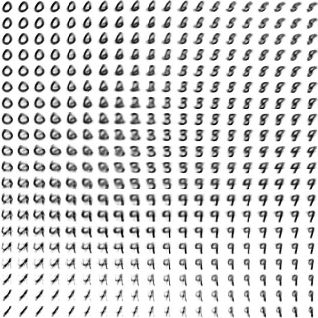

# Variational-Auto-Encoder
PyTorch implementation of Variational Auto Encoder as described in [Auto-Encoding Variational Bayes](https://arxiv.org/abs/1312.6114) from ICLR 2014.


<div align='center'>
  
  <span> <p> CAption </span>
</div>

### Walking Through Latent Space
<div align='center'>
  
</div>

### Implementation Details
- This implementation is inspired by [Building Autoencoders in Keras](https://blog.keras.io/building-autoencoders-in-keras.html).
- All the code was written and ran on Google Colab.

### Requirements
``` bash
torch
torchvision
numpy
matplotlib
```

### References
1. **Diederik P. Kingma, et al.** *Auto-Encoding Variational Bayes* [[arxiv](https://arxiv.org/abs/1312.6114)]
